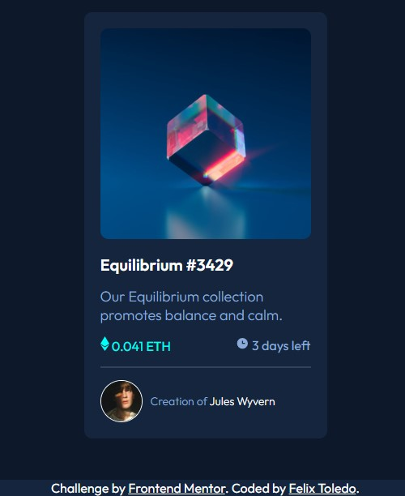

# Frontend Mentor - NFT preview card component solution

This is a solution to the [NFT preview card component challenge on Frontend Mentor](https://www.frontendmentor.io/challenges/nft-preview-card-component-SbdUL_w0U). Frontend Mentor challenges help you improve your coding skills by building realistic projects. 

This is my first solution in Frontend Mentor.

## Table of contents

- [Overview](#overview)
  - [The challenge](#the-challenge)
  - [Screenshot](#screenshot)
  - [Links](#links)
- [My process](#my-process)
  - [Built with](#built-with)
  - [What I learned](#what-i-learned)
  - [Useful resources](#useful-resources)
- [Author](#author)

## Overview

### The challenge

Users should be able to:
- View the optimal layout depending on their device's screen size
- See hover states for interactive elements

### Screenshot

### Links

- Solution URL: ([URL](https://github.com/felix-toledo/nft-challenge-frontendmentor)
- Live Site URL: ([URL]([https://your-live-site-url.com](https://felix-toledo.github.io/nft-challenge-frontendmentor/))

## My process

### Built with

- Semantic HTML5 markup
- SCSS custom properties
- Flexbox
- CSS Grid
- Mobile-first workflow

### What I learned

With this project, I Learned how to do a hover in images. Also I learned about design and it was really useful for improving my scss and html knowledge.

### Useful resources

- [Example resource 1](https://www.w3schools.com/howto/tryit.asp?filename=tryhow_css_image_overlay_opacity) - This helped me for giving a hover overlay to the image.

## Author

- GitHub - [Felix Toledo](https://github.com/felix-toledo)
- Frontend Mentor - [@felix-toledo](https://www.frontendmentor.io/profile/felix-toledo)
- Twitter - [@_felixtoledo](https://www.twitter.com/_felixtoledo)

